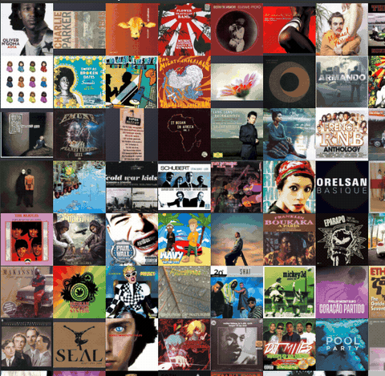

# Album Mosaic Plugin for Fooyin

Fooyin plugin to display an infinite scrolling mosaic of album covers with animations.



## Features

### Grid & Navigation
- **Infinite Grid**: Cyclic scrolling through all albums in your Fooyin collection
- **Stable Scrolling**: Pre-shuffled album order preserved across scrolls — covers stay loaded
- **Adaptive Grid**: Square cells automatically sized to fit the screen
- **Configurable Column Count**: Adjust the number of columns in settings
- **Configurable Background Color**: Choose any color for the grid background

### Cover Loading
- **Shared Cover Repository**: Uses Fooyin's shared `CoverRepository` (0.12.6+) for efficient cover loading
- **Adaptive Cover Size**: Automatically selects the best thumbnail size based on cell dimensions
- **Elegant Placeholder**: Gradient background with musical icon for albums without covers
- **No-Flash Animation**: Cover readiness is checked before switching — no placeholder flash during animations

### Animations
- **5 Animation Types**: 3D Flip, Crossfade, Slide, Zoom, Page Curl
- **Random Mode**: Randomly selects an animation type for each trigger
- **3 Speeds**: Fast (300ms), Medium (600ms), Slow (1000ms)
- **3 Scopes**: Single cell, Multiple cells (up to 5 simultaneous), Wave (column-by-column sweep)
- **Easing**: Cubic ease-in-out for smooth start/stop
- **3D Perspective**: Flip animation includes shadow, edge highlight, depth dimming, and perspective shear

### Playback & Interaction
- **Double-Click Playback**: Creates a playlist and plays the album via `PlaylistHandler`
- **Context Menu**: Right-click for Play, Queue, Add to Playlist, Album Info, Settings
- **Album Info Dialog**: Shows album name, artist, track count, and total duration
- **Currently Playing Highlight**: Green border on the album currently being played
- **Hover Overlay**: Album name displayed on hover

### Filtering & Search
- **Genre Filter**: Filter the mosaic by genre
- **Artist Filter**: Filter the mosaic by artist
- **Search Integration**: Connects to Fooyin's search widget via `searchEvent()`

### Persistence & Dynamic Updates
- **Layout State Persistence**: Scroll offset saved and restored between sessions
- **Dynamic Library Updates**: Responds to `tracksLoaded`, `tracksAdded`, `tracksDeleted` signals
- **Cached Album Tracks**: Album tracks cached during metadata load for fast playback/queue

## Prerequisites

- **Fooyin 0.12.6** with development headers (`INSTALL_HEADERS=ON`)
- CMake (>= 3.14)
- Qt6
- C++ compiler

> **Note**: This plugin is compiled against Fooyin 0.12.6 and is not compatible with older versions (0.10.3 and below) due to ABI changes.

## Installation

### Option 1: Install via Fooyin GUI (easiest)

1. Download `fyplugin_albummosaicplugin-linux-x86_64.so` from the [latest release](https://github.com/dewiweb/fooyin-album-mosaic-plugin/releases)
2. Open Fooyin → Settings → Plugins
3. Click "Install…" and select the `.so` file
4. Restart Fooyin

### Option 2: Manual copy

```bash
# Download the .so from releases, then:
cp fyplugin_albummosaicplugin-linux-x86_64.so ~/.local/lib/fooyin/plugins/fyplugin_albummosaicplugin.so
```

### Option 3: Arch Linux (AUR)

```bash
yay -S fooyin-plugin-albummosaic
```

### Option 4: Build from source

```bash
git clone https://github.com/dewiweb/fooyin-album-mosaic-plugin.git
cd fooyin-album-mosaic-plugin

# Build and install
./scripts/build.sh --install

# Or manual build:
mkdir build && cd build
cmake .. -DCMAKE_PREFIX_PATH=/path/to/fooyin-dev
cmake --build .
cp fyplugin_albummosaicplugin.so ~/.local/lib/fooyin/plugins/
```

### Flatpak

For the Flatpak version of Fooyin, the plugin must be built against the matching KDE SDK:

```bash
# Install the KDE 6.11 SDK first
flatpak install org.kde.Sdk/x86_64/6.11

# Build and install for Flatpak
./scripts/build-flatpak.sh --install
```

## Usage

1. Open Fooyin
2. Go to layout editing mode
3. Add the "Album Mosaic" widget to your layout
4. Right-click the widget → Settings to configure:
   - Animation type, speed, and scope
   - Number of columns (or Ctrl+scroll to zoom)
   - Background color
   - Genre and artist filters
5. Use the mouse wheel to scroll infinitely through your albums
6. Double-click a cover to play the album
7. Right-click a cover for context menu options

Each widget instance keeps its own configuration (columns, animation, sort, filters) in the layout — multiple mosaics can run side by side with different settings.

## Build Scripts

| Script | Usage |
|--------|-------|
| `scripts/build.sh` | `./scripts/build.sh --install` — build + install (copy + RUNPATH patch) |
| `scripts/build-flatpak.sh` | `./scripts/build-flatpak.sh --install` — build for Flatpak (requires KDE 6.11 SDK) |
| `scripts/test.sh` | `./scripts/test.sh [--target=dev\|deb\|flatpak\|old]` — test with different Fooyin installations |

## Architecture

### Plugin Structure

- `albummosaicplugin.h/cpp` — Plugin entry point, settings registration
- `albummosaicwidget.h/cpp` — Main widget: grid rendering, animations, interaction
- `albummosaicsettingsdialog.h/cpp` — Settings dialog
- `CMakeLists.txt` — Build configuration
- `metadata.json` — Plugin metadata

### Key Design Decisions

- **Pre-shuffled album order**: A permutation (`m_albumOrder`) is computed once on load. Scrolling shifts a window through this permutation — covers stay loaded.
- **Multi-cell animation**: `QVector<ActiveAnim>` tracks concurrent animations, each with its own elapsed timer, delay, and resolved animation type.
- **Deferred cover swap**: At 50% of animation, the new cover is checked for readiness. If not ready, the old cover stays — no flash.
- **Shared cover repository**: Uses `GuiPluginContext::coverRepository()` (Fooyin 0.12.6) instead of creating an isolated `CoverProvider`.

## Compatibility

| Fooyin Version | Status |
|---|---|
| 0.12.6 (source build) | Full support |
| 0.12.6 (Debian package) | Full support |
| 0.12.6 (Flatpak) | Requires KDE 6.11 SDK build |
| 0.10.3 and below | Not compatible (ABI change) |

## License

GNU General Public License v3.0

## Acknowledgments

- [Fooyin](https://github.com/fooyin/fooyin) for its excellent plugin system and CoverProvider API
- [fooyin-plugin-examples](https://github.com/fooyin/fooyin-plugin-examples) for the development guidelines
